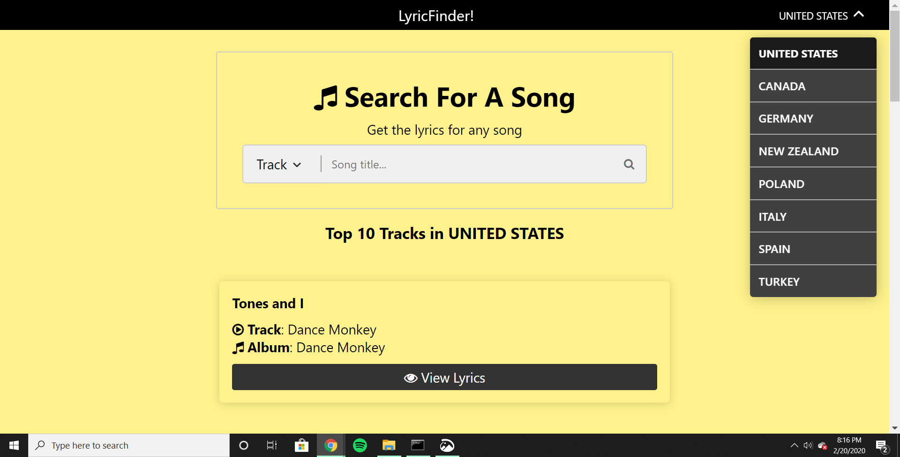
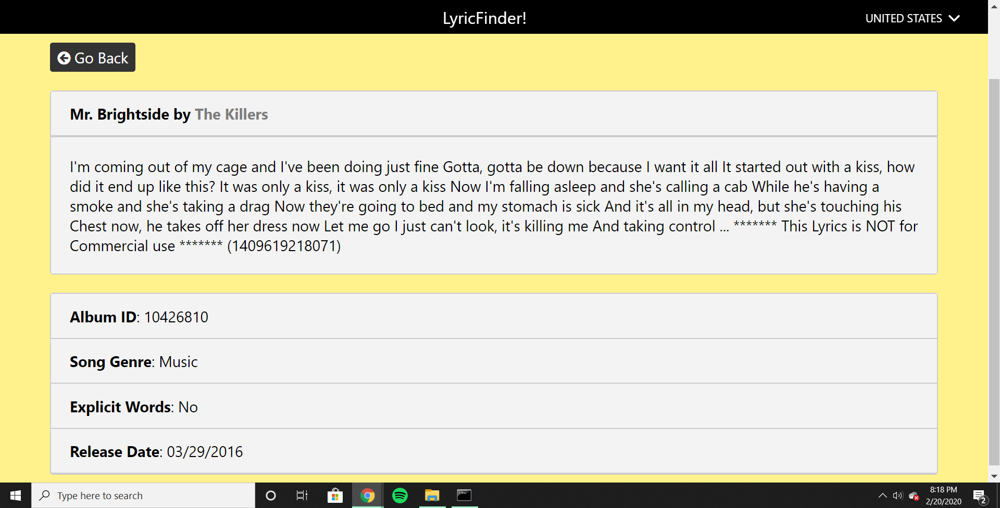

<h1>LyricFinder (Portfolio Project)</h1>

<h3>What is LyricFinder? It's a full-stack web App written in Javascript/React that utilizes the MusixMatch Developer API, as well as Sass &amp; Bootstrap for a modern interface. I decided to create this application as a passion project out of nostalgia; when I was younger I would quite often search the lyrics of songs that I enjoyed, but did not quite know completely.</h3>

<h3>This web app is quite intuitive and serves a simple purpose; the user types in any Artist or Track, and the API fetches results based on their search and provides back the lyrics, in addition to a few extra details. The Navbar is also built with a dropdown menu that features several countries, in case the user wants to find lyrics of an artist/track that isn't based in the United States.</h3>

<h3>Here is a screenshot of the front page:</h3>

<h3>Here is a screenshot of the return result:</h3>

